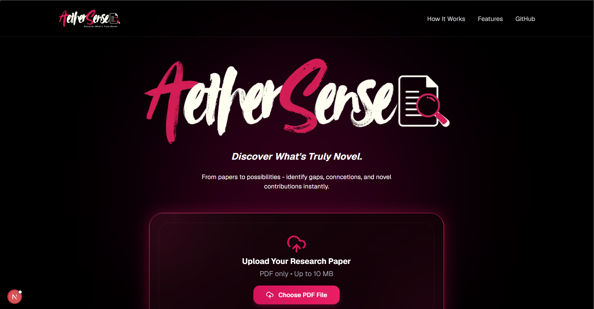
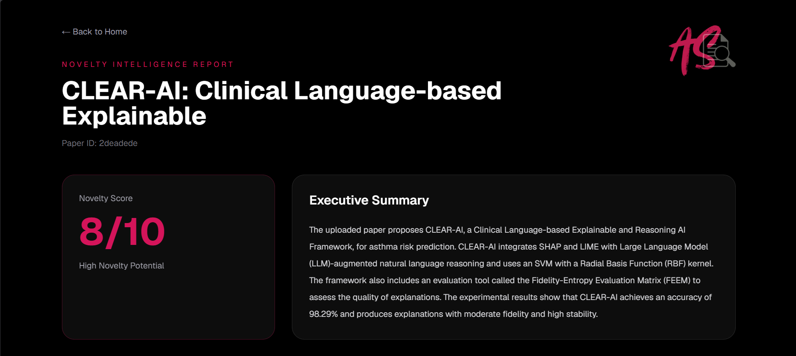

# AetherSense

> **Discover What's Truly Novel.**
>
> Literature-grounded AI that transforms research papers into actionable novelty intelligence.

AetherSense is an end-to-end AI platform that helps researchers evaluate the novelty of academic work using Retrieval-Augmented Generation (RAG), semantic similarity search, literature-grounded reasoning, and Large Language Models.

Upload a research paper and receive a comprehensive intelligence report containing executive summaries, related literature, similarity rankings, key contributions, research gaps, future research directions, and an estimated novelty score.

---

## ✨ Preview

### Landing Experience

> 

### Intelligence Report

> 

---

## 🚀 Features

### 📄 Intelligent PDF Analysis

- Upload academic papers in PDF format.
- Automatic extraction of titles, abstracts, and conclusions.
- Persistent parsing and structured storage.

### 🔍 Literature Intelligence

- Retrieval of semantically related papers using OpenAlex.
- Embedding-based similarity ranking.
- Literature-grounded evidence discovery.

### 🧠 Novelty Intelligence Engine

Generate executive reports containing:

- Executive summaries
- Novelty scores
- Key contributions
- Research gaps
- Future research directions
- Related literature insights

### ⚡ Modern Intelligence Dashboard

- Premium dark-mode interface.
- Interactive report experience.
- Research-focused visual presentation.
- Responsive Next.js frontend.

---

## 🏗️ System Architecture

```text
Research Paper (PDF)
        │
        ▼
PDF Parsing & Metadata Extraction
        │
        ▼
Chunk Generation
        │
        ▼
BGE Embedding Generation
        │
        ▼
ChromaDB Vector Store
        │
        ▼
LLM Query Reformulation
        │
        ▼
OpenAlex Literature Retrieval
        │
        ▼
Semantic Similarity Ranking
        │
        ▼
Groq LLM Reasoning
        │
        ▼
Novelty Intelligence Engine
        │
        ▼
Premium Interactive Report
```

---

## ⚙️ Tech Stack

### Frontend

- Next.js 15
- React
- TypeScript
- Tailwind CSS

### Backend

- FastAPI
- Python

### Retrieval & Vector Search

- ChromaDB
- OpenAlex API
- Cosine Similarity

### AI & NLP

- Sentence Transformers
- BAAI/bge-small-en-v1.5
- Retrieval-Augmented Generation (RAG)

### LLM Reasoning

- Groq API
- Llama 3.3 70B

### Document Processing

- PyMuPDF

---

## 📂 Project Structure

```text
AetherSense/
│
├── backend/
│   ├── routes/
│   ├── services/
│   ├── parsed/
│   ├── chromadb/
│   └── app.py
│
├── frontend/
│   ├── app/
│   ├── components/
│   ├── lib/
│   ├── public/
│   └── package.json
│
├── README.md
└── requirements.txt
```

---

## ✨ Example Output

```json
{
  "retrieval_metadata": {
    "keywords": [
      "asthma risk prediction",
      "explainable AI in healthcare",
      "SHAP-LIME integration"
    ]
  },
  "similar_papers": [
    {
      "title": "A Survey on Explainable Artificial Intelligence (XAI): Toward Medical XAI",
      "similarity": 80.31
    }
  ],
  "novelty_analysis": {
    "summary": "...",
    "contributions": [...],
    "research_gaps": [...],
    "future_work": [...],
    "novelty_score": 8
  }
}
```

---

## 🎯 Current Status

### ✅ AetherSense MVP Completed

Implemented:

- [x] Premium Next.js Landing Page
- [x] PDF Upload Pipeline
- [x] PDF Parsing & Metadata Extraction
- [x] Chunk Generation
- [x] BGE Embedding Generation
- [x] ChromaDB Integration
- [x] OpenAlex Literature Retrieval
- [x] LLM Query Reformulation
- [x] Similarity Ranking Engine
- [x] Literature-Grounded Novelty Analysis
- [x] Executive Summary Generation
- [x] Contribution Extraction
- [x] Research Gap Identification
- [x] Future Direction Suggestions
- [x] Novelty Score Generation
- [x] Interactive Intelligence Report

---

## 🚀 Upcoming Enhancements

- [ ] PDF Viewer Integration
- [ ] Report Export (PDF)
- [ ] Citation Network Visualization
- [ ] Multi-Paper Comparison
- [ ] Literature Trend Analysis
- [ ] Research Idea Validation
- [ ] Knowledge Graph Generation
- [ ] Deployment on Vercel and Render

---

## 💡 Use Cases

### Researchers

Assess novelty before manuscript submission and identify overlooked literature.

### Students

Accelerate literature reviews and related work exploration.

### Innovators

Validate research-driven startup ideas using evidence from existing work.

### Academic Institutions

Support evidence-based research discovery and decision-making.

---

## 📜 Disclaimer

AetherSense provides literature-grounded insights to assist researchers. Novelty scores are intended as decision-support signals and should not replace formal peer review.

---

## 🌟 Vision

Transform weeks of literature exploration into minutes of actionable intelligence.

AetherSense empowers researchers to identify novelty, uncover hidden connections, and accelerate scientific discovery through literature-grounded AI.

---

## 👨‍💻 Author

**Shivam Pawar**

Built with the vision of transforming weeks of literature exploration into minutes of actionable intelligence through AI-powered research analysis.

---

> **AetherSense — Discover What's Truly Novel.**
